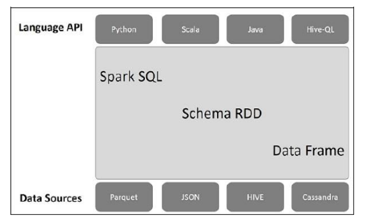

# Introduction

SpoarkSQL is a library for structured data processing. 
It provides an abstraction mechanism &#x2013; the main one is called `DataFrame` &#x2013; which can 
serve as  a distributed SQL query engine.

Spark SQL offers the following features:

-   **Integrated**. 
    -   Seamlessly mix SQL queries with Spark programs.
    -   Spark SQL lets you query structured data as a distributed dataset (RDD) in Spark
    -   This tight integration makes it easy to run SQL queries alongside complex analytic algorithms

-   **Unified Data Access**
    -   Load and query data from a variety of different sources like: Apache Hive tables, parquet files, JSON files, etc.

-   **Scalability**
    -   Use the same engine for both interactive and long queries
    -   SparkSQL leverages on the RDD model to provide fault tolerance an scalability

# Architecture

The architecture contains three layers namely:

1.  Language API − Spark is compatible with different languages and Spark SQL. It is also, supported by these languages- API (python, scala, java, HiveQL).
2.  Schema RDD − Spark Core is designed with special data structure called RDD. Generally, Spark SQL works on schemas, tables, and records. Therefore, we can use the Schema RDD as temporary table. We can call this Schema RDD as Data Frame.
3.  Data Sources − Usually the Data source for spark-core is a text file, Avro file, etc. However, the Data Sources for Spark SQL is different. Those are Parquet file, JSON document, HIVE tables, and Cassandra database.

# What is a DataFrame

A DataFrame is a distributed collection of data, 
which is organized into named columns. 
You can think of a DataFrame as a relational table.

DataFrames can be constructed from a variety of different sources such as Hive tables, Structured Data files,
external database, or also an existing RDD. 

## Features of a DataFrame

-   Ability to process the data in the size of Kilobytes to Petabytes on a single node cluster to large cluster
-   Supports different data formats (Avro, csv, elastic search, and Cassandra) and storage systems (HDFS, HIVE tables, mysql, etc).
-   State of art optimization and code generation through the Spark SQL Catalyst optimizer (tree transformation framework).
-   Can be easily integrated with all Big Data tools and frameworks via Spark-Core.
-   Optimized application of udf function over the entire dataframe.
    The following instructions will create a new column whose values are given by the column value to the power of two

    import org.apache.spark.sql.functions.udf
    val square = (x=> x*x)
    val squaredDF = df.withColumn("square", square("value"))

-   Example

    Imagine you have the following data, formatted as a JSON file:
    
        {
           {"id" : "1201", "name" : "satish", "age" : "25"}
           {"id" : "1202", "name" : "krishna", "age" : "28"}
           {"id" : "1203", "name" : "amith", "age" : "39"}
           {"id" : "1204", "name" : "javed", "age" : "23"}
           {"id" : "1205", "name" : "prudvi", "age" : "23"}
        }
    
    You can read this file and create a dataframe as follows:
    
        ...
        val spark = SparkSession
              .builder
              .appName("SparkSQL")
              .master("local[*]")
              .getOrCreate()
        val df =  spark.sqlContext.read.json("example.json")
        df.show()
    
    The last instruction returns the following result:
    
        +----+------+--------+
        |age | id   |  name  |
        +----+------+--------+
        | 25 | 1201 | satish |
        | 28 | 1202 | krishna|
        | 39 | 1203 | amith  |
        | 23 | 1204 | javed  |
        | 23 | 1205 | prudvi |
        +----+------+--------+
    
    You can access to the structure underlying a dataframe as follows:
    
        df.printSchema
    
    In this case it returns the following:
    
        root
           |-- age: string (nullable = true)
           |-- id: string (nullable = true)
           |-- name: string (nullable = true)
    
    You handle a DataFrame in a very similar fashion to a Pandas dataframe.
    
    For instance:
    
        df.select("name").show 
    
    Or also
    
        // This import is needed to use the $-notation
        import spark.sqlContext.implicts._ 
        df.select($"name").show 
    
    It returns:
    
        +--------+
        |  name  |
        +--------+
        | satish |
        | krishna|
        | amith  |
        | javed  |
        | prudvi |
        +--------+
    
    You can use filter:
    
        dfs.filter(dfs("age") > 23).show()
    
    It returns:
    
        +----+------+--------+
        |age | id   | name   |
        +----+------+--------+
        | 25 | 1201 | satish |
        | 28 | 1202 | krishna|
        | 39 | 1203 | amith  |
        +----+------+--------+
    
    You can group and apply aggregate functions to your data as follows:
    
        dfs.groupBy("age").count().show()
    
    It returns:
    
        +----+-----+
        |age |count|
        +----+-----+
        | 23 |  2  |
        | 25 |  1  |
        | 28 |  1  |
        | 39 |  1  |
        +----+-----+

## Running SQL Queries

An SQLContext enables applications to run SQL queries programmatically while running SQL functions and returns the result as a DataFrame.

Generally, in the background, SparkSQL supports two different methods for converting existing RDDs into DataFrames.

-   Inferring the schema via reflection

    This method uses reflection to generate the schema of an RDD that contains specific types 
    of objects. The Scala interface for Spark SQL supports automatically converting an RDD containing case classes to a DataFrame. 
    The **case class** defines the schema of the table. The names
    of the arguments to the case class are read using reflection and they become the names of the columns.
    
    Case classes can also be nested or contain complex
    types such as Sequences or Arrays. This RDD can be implicitly be
     converted to a DataFrame and then registered as a table. 
    Tables can be used in subsequent SQL statements.
    
    -   Example
    
        Imagine you are given with the following data:
        
            1201, satish, 25
            1202, krishna, 28
            1203, amith, 39
            1204, javed, 23
            1205, prudvi, 23
        
        First you need to define a case class &#x2013; which is  class that only define its contructor &#x2013; to provide your data with a fixed structure:
        
            case class Employee(id: Int, name: String, age: Int)
        
        Next, you create an RDD mapping each line to the above case class and then convert it to a DataFrame
        
            val spark = SparkSession
                  .builder
                  .appName("SparkSQL")
                  .master("local[*]")
                  .getOrCreate()
            
            val df =  spark.sparkContext.textFile("employee.txt")
               .map(_.split(",")).map(e=>Employee(e(0).trim.toInt, e(1), e(2).trim.toInt)).toDF
            df.show()
        
        Now you have a fully functional data frame. If you want to use the SQL engine your first need to register
        the dataframe as a table:
        
            empl.registerTempTable("employee") //set the name of the table associated with the dataset
        
        Then your can perform regular SQL query as follows:
        
            spark.sqlContext.sql("Select * from employee*").show
        
        It returns:
        
            +------+---------+----+
            |  id  |  name   |age |
            +------+---------+----+
            | 1201 | satish  | 25 |
            | 1202 | krishna | 28 |
            | 1203 | amith   | 39 |
            | 1204 | javed   | 23 |
            | 1205 | prudvi  | 23 |
            +------+---------+----+
        
        SparkSQL understands any sql query &#x2013; so if you know SQL you are good to go.

-   Specify the schema programmatically

    The second method for creating DataFrame is through programmatic interface that allows you to construct a schema and then apply it to an existing RDD. We can create a DataFrame programmatically using the following three steps.
    
    -   Create an RDD of Rows from an Original RDD.
    -   Create the schema represented by a StructType matching the structure of Rows in the RDD created in Step 1.
    -   Apply the schema to the RDD of Rows via createDataFrame method provided by SQLContext.
    
    -   Example
    
        Imagine you are given with the following data:
        
            1201, satish, 25
            1202, krishna, 28
            1203, amith, 39
            1204, javed, 23
            1205, prudvi, 23
        
        Next, you create an RDD from the text file.
        
            //remember to include these imports
            import org.apache.spark.sql.Row
            import org.apache.spark.sql.types.{StructType, StructField, StringType}
            
            val spark = SparkSession
                  .builder
                  .appName("SparkSQL")
                  .master("local[*]")
                  .getOrCreate()
            
            val df =  spark.sparkContext.textFile("employee.txt")
        
        Now, instead of defining a case class as we did earlier, we define schema with a String.
        
            val schemaString = "id name age"
        
        The above string is then used to generate a schema as follows:
        
            val schema = StructType(schemaString.split(" ").map(fieldName => =StructField(fieldName, StringType, true)))
        
        Use the following command to convert an RDD (employee) to Rows. It means, here we are specifying the logic for reading the RDD data and store it into rowRDD. Here we are using two map functions: one is a delimiter for splitting the record string (.map(.split(","))) and the second 
        map function for defining a Row with the field index 
        value (.map(e ⇒ Row(e(0).trim.toInt, e(1), e(2).trim.toInt))).
        
            val rowRDD = employee.map(_.split(",")).map(e ⇒ Row(e(0).trim.toInt, e(1), e(2).trim.toInt))
            val employeeDF = sqlContext.createDataFrame(rowRDD, schema)

# Comparative evaluation

## DataFrame vs DataSet

They are basically the same object, namely a collection of structured data 
&#x2013; for instance DataSet[Person], DataSet[(String, Double)]. 

Actually, a `DataFrame` is an alias for `Dataset[Row]`. 

The major difference between the two is that the structure of the data contained within
a  `DataFrame`  is inferred at runtime, while for a `DataSet` object Scala is able to infer the 
actual type of the objects at compile time. 
Clearly, this second mechanism is beneficial in terms of performance and it is also less prone 
to potential errors.

## DataSet vs RDD

An RDD can be converted to a `DataSet` object with the method `toDS`.

DataSets are more convenient than RDD for the following reasons:

-   better efficiency
-   better interoperability with other libraries:
    -   MLlib relies on Datasets
    -   Spark streaming is moving towards structured streaming
    -   Everything that use apache Avro

