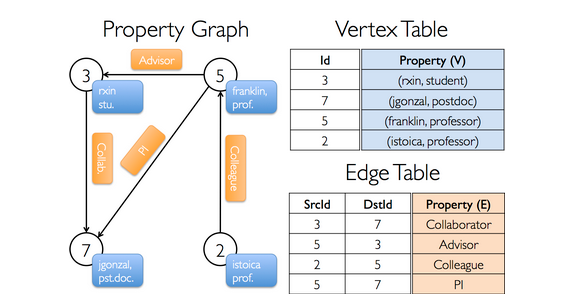
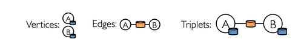
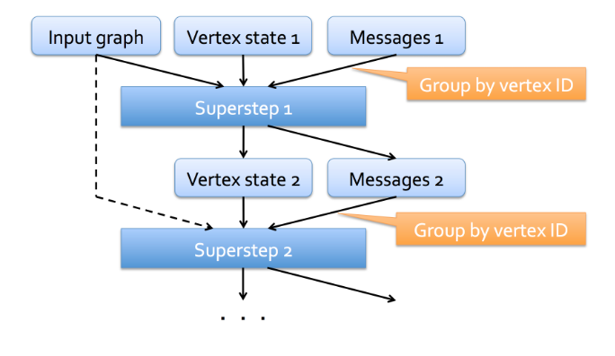
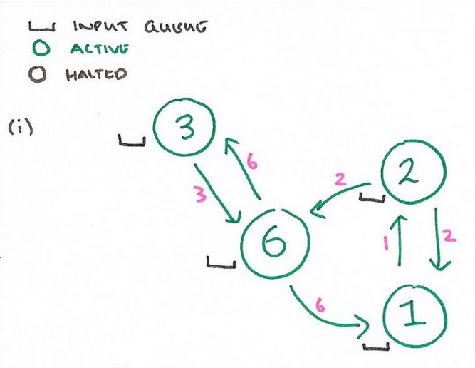
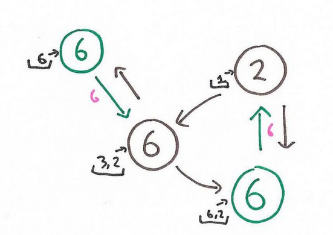
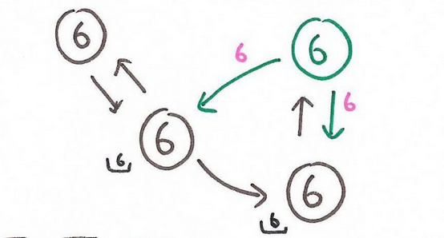
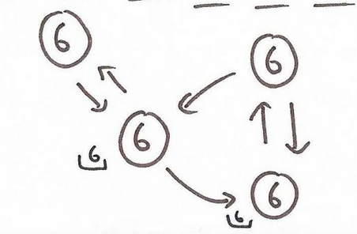

# Introduction

Overview

GraphX is a new component in Spark
 for graphs and graph-parallel computation. 

At a high level, GraphX extends the Spark RDD by
 introducing a new Graph abstraction: a directed multigraph 
with properties attached to each vertex and edge. 

To support graph computation, GraphX exposes a set of fundamental operators
 (e.g., subgraph, joinVertices, and aggregateMessages) as well 
as an optimized variant of the Pregel API. 
In addition, GraphX includes a growing collection of graph algorithms
 and builders to simplify graph analytics tasks.

In order to use this library in your driver program you need to add the following imports:

    import org.apache.spark._
    import org.apache.spark.graphx._
    import org.apache.spark.rdd.RDD

# The Property Graph

It is a directed multigraph with user defined objects attached to each vertex and edge.

A directed multigraph is simply a directed graph that can have multiple edges connecting the same 
pair of vertices. This ability enable the possibility to represent multiple relationships between 
the nodes in the graph. 

Each vertex is associated with a unique 64-bit long key identifier, aka `VertexId`. 
Similarly edges have source and destination identifiers.

The property graph is parameterized over the vertex and edge types, denoted by VD and ED, respectively.
VD and ED are therefore the types associated with objects stored in the graph.

You can also exploit inheritance to have specialized nodes within the graph as follows:

    class VertexProperty()
    case class UserProperty(val name: String) extends VertexProperty
    case class ProductProperty(val name: String, val price: Double) extends VertexProperty
    // The graph might then have the type:
    var graph: Graph[VertexProperty, String] = null

In this case the `Graph` can store two different types of objects.

Graphs inherit all the good things from the RDD.

-   Graphs are immutable, therefore any change to the values contained in a graph instance produce a new instance &#x2013;
    graphs cannot be changed in place!
-   Graphs are distributed. The Graph is partitioned along the worker nodes using a range of heuristic methods.
-   Graphs are fault tolerant. Therefore, in case of failure of a worker node, the partition can be easily recreated

## The property Graph under the hood

A property Graph is simply a compound type having two typed collections (RDDs).

    class Graph[VD, ED] {
      val vertices: VertexRDD[VD]
      val edges: EdgesRDD[ED]
    }

`VertexRDD` and `EdgesRDD` are two specialized and optimized versions of `RDD[(VertexId, VD)]` and 
`RDD[Edge[ED]]`, respectively. As opposed to a classic RDD, both VertexRDD and EdgesRDD provide specialized
operations tailored for Graph computation.

## Example: How to use the Property Graph

Suppose you want to construct the following graph.

It has the following signature:

    val userGraph: Graph[(String, String), String]

You can construct a Graph object in multiple ways. 
The following method is probably the most general and useful.

    // Assume the SparkContext has already been constructed
    val sc: SparkContext
    // Create an RDD for the vertices
    val users: RDD[(VertexId, (String, String))] =
      sc.parallelize(Seq((3L, ("rxin", "student")), (7L, ("jgonzal", "postdoc")),
    		       (5L, ("franklin", "prof")), (2L, ("istoica", "prof"))))
    // Create an RDD for edges
    val relationships: RDD[Edge[String]] =
      sc.parallelize(Seq(Edge(3L, 7L, "collab"),    Edge(5L, 3L, "advisor"),
    		       Edge(2L, 5L, "colleague"), Edge(5L, 7L, "pi")))
    // Define a default user in case there are relationship with missing user
    val defaultUser = ("John Doe", "Missing")
    // Build the initial Graph
    val graph = Graph(users, relationships, defaultUser)

-   `Edge` is a built in class for storing edges information. It is defined as:

     Edge[ED](
    srcId: VertexId = 0, 
    dstId: VertexId = 0,
     attr: ED = null.asInstanceOf[ED]) extends Serializable with Product

-   The Graph constructor takes as input two RDDs and a default user, which is needed to handle situations when a vertex 
    is defined in the EdgeRDD but not in the VertexRDD.

Given a Graph instance, you can query both the RDD containing the vertices and the edges directly from that 
instance.

    val graph: Graph[(String, String), String] // Constructed from above
    // Count all users which are postdocs
    graph.vertices.filter { case (id, (name, pos)) => pos == "postdoc" }.count
    // Count all the edges where src > dst
    graph.edges.filter(e => e.srcId > e.dstId).count
    // or equivalently
    graph.edges.filter{case Edge(src, dst, prop) => src >  dst}.count

It should be noted that `graph.vertices` returns an `VertexRDD[(String, String)]` in this case, which 
it is interpreted as an `RDD[(VertexID, (String, String)]` &#x2013; this is why we can use the `case` construct 
([take a look here](https://docs.scala-lang.org/tour/pattern-matching.html)). The same holds when you access the edges with  `graph.edges`. This returns an instance
of `EdgeRDD` which contains objects of type `Edge[String]`.

In addition to these two mechanism there is a third one, which exposes a triplet view. 

A triplet view consists of a series of `EdgeTriplet` objects. An `EdgeTriplet` object merges the information
about the two vertices &#x2013; endpoints of the edges &#x2013; and the relationship between them. 
Conceptually, you can think at the figure:

<#+caption: Edge Triplet

The `EdgeTriplet` class extends `Edge` by adding the attributes of both the source node and the target node.

You can use the triplet view as in the following example:

    val graph: Graph[(String, String), String] // Constructed from above
    // Use the triplets view to create an RDD of facts.
    val facts: RDD[String] =
      graph.triplets.map(triplet =>
        triplet.srcAttr._1 + " is the " + triplet.attr + " of " + triplet.dstAttr._1)
    facts.collect.foreach(println(_))

# Graph Operations

As any other RDD, a graph supports basic operations such as `map`, `filter`, `reduce` and so on.
In addition to that, graphs support a number of transformations specifically meaningful when working with graph.

This kind of operations are defined as `GraphOps` and most of the time they are accessible as 
members of a Graph object.

The following list provide a summary of the major GraphOps directly accessible from a 
graph instance.

    /** Summary of the functionality in the property graph */
    class Graph[VD, ED] {
      // Information about the Graph ===================================================================
      val numEdges: Long
      val numVertices: Long
      val inDegrees: VertexRDD[Int]
      val outDegrees: VertexRDD[Int]
      val degrees: VertexRDD[Int]
      // Views of the graph as collections =============================================================
      val vertices: VertexRDD[VD]
      val edges: EdgeRDD[ED]
      val triplets: RDD[EdgeTriplet[VD, ED]]
      // Functions for caching graphs ==================================================================
      def persist(newLevel: StorageLevel = StorageLevel.MEMORY_ONLY): Graph[VD, ED]
      def cache(): Graph[VD, ED]
      def unpersistVertices(blocking: Boolean = false): Graph[VD, ED]
      // Change the partitioning heuristic  ============================================================
      def partitionBy(partitionStrategy: PartitionStrategy): Graph[VD, ED]
      // Transform vertex and edge attributes ==========================================================
      def mapVertices[VD2](map: (VertexId, VD) => VD2): Graph[VD2, ED]
      def mapEdges[ED2](map: Edge[ED] => ED2): Graph[VD, ED2]
      def mapEdges[ED2](map: (PartitionID, Iterator[Edge[ED]]) => Iterator[ED2]): Graph[VD, ED2]
      def mapTriplets[ED2](map: EdgeTriplet[VD, ED] => ED2): Graph[VD, ED2]
      def mapTriplets[ED2](map: (PartitionID, Iterator[EdgeTriplet[VD, ED]]) => Iterator[ED2])
        : Graph[VD, ED2]
      // Modify the graph structure ====================================================================
      def reverse: Graph[VD, ED]
      def subgraph(
          epred: EdgeTriplet[VD,ED] => Boolean = (x => true),
          vpred: (VertexId, VD) => Boolean = ((v, d) => true))
        : Graph[VD, ED]
      def mask[VD2, ED2](other: Graph[VD2, ED2]): Graph[VD, ED]
      def groupEdges(merge: (ED, ED) => ED): Graph[VD, ED]
      // Join RDDs with the graph ======================================================================
      def joinVertices[U](table: RDD[(VertexId, U)])(mapFunc: (VertexId, VD, U) => VD): Graph[VD, ED]
      def outerJoinVertices[U, VD2](other: RDD[(VertexId, U)])
          (mapFunc: (VertexId, VD, Option[U]) => VD2)
        : Graph[VD2, ED]
      // Aggregate information about adjacent triplets =================================================
      def collectNeighborIds(edgeDirection: EdgeDirection): VertexRDD[Array[VertexId]]
      def collectNeighbors(edgeDirection: EdgeDirection): VertexRDD[Array[(VertexId, VD)]]
      def aggregateMessages[Msg: ClassTag](
          sendMsg: EdgeContext[VD, ED, Msg] => Unit,
          mergeMsg: (Msg, Msg) => Msg,
          tripletFields: TripletFields = TripletFields.All)
        : VertexRDD[A]
      // Iterative graph-parallel computation ==========================================================
      def pregel[A](initialMsg: A, maxIterations: Int, activeDirection: EdgeDirection)(
          vprog: (VertexId, VD, A) => VD,
          sendMsg: EdgeTriplet[VD, ED] => Iterator[(VertexId, A)],
          mergeMsg: (A, A) => A)
        : Graph[VD, ED]
      // Basic graph algorithms ========================================================================
      def pageRank(tol: Double, resetProb: Double = 0.15): Graph[Double, Double]
      def connectedComponents(): Graph[VertexId, ED]
      def triangleCount(): Graph[Int, ED]
      def stronglyConnectedComponents(numIter: Int): Graph[VertexId, ED]
    }

Operators can be classified into three different categories:

-   Property Operators

    They are very similar to the map operator of a regular RDD.
    
        class Graph[VD, ED] {
          def mapVertices[VD2](map: (VertexId, VD) => VD2): Graph[VD2, ED]
          def mapEdges[ED2](map: Edge[ED] => ED2): Graph[VD, ED2]
          def mapTriplets[ED2](map: EdgeTriplet[VD, ED] => ED2): Graph[VD, ED2]
        }
    
    -   Each of these operators yields a
        new graph with the vertex
        or edge properties modified
        by the user defined map function.
    
    -   The structure of the graph is not affected by these operations
    -   Note that in order to use GraphX optimization you must prefer the following snippet
        
            val newGraph = graph.mapVertices((id, attr) => mapUdf(id, attr))
        
        to the following one
        
             val newVertices = graph.vertices.map { case (id, attr) => (id, mapUdf(id, attr)) }
            val newGraph = Graph(newVertices, graph.edges)
        
        Although they accomplish the same task, only the first one preserves the structural properties an it 
        exploits GraphX optimizations.
    
    -   When to use these oprators
    
        Usually, you want to use these transformations to prepare your graph before the application of some 
        algorithm.
        For instance, if you want to prepare the graph in order to compute the page rank.
        
            // Given a graph where the vertex property is the out degree
            val inputGraph: Graph[Int, String] =
              graph.outerJoinVertices(graph.outDegrees)((vid, _, degOpt) => degOpt.getOrElse(0))
            // Construct a graph where each edge contains the weight
            // and each vertex is the initial PageRank
            val outputGraph: Graph[Double, Double] =
              inputGraph.mapTriplets(triplet => 1.0 / triplet.srcAttr).mapVertices((id, _) => 1.0)

-   Structural Operators

    Currently GraphX supports only a simple set of commonly used structural operators.
    
        class Graph[VD, ED] {
          def reverse: Graph[VD, ED]
          def subgraph(epred: EdgeTriplet[VD,ED] => Boolean,
        	       vpred: (VertexId, VD) => Boolean): Graph[VD, ED]
          def mask[VD2, ED2](other: Graph[VD2, ED2]): Graph[VD, ED]
          def groupEdges(merge: (ED, ED) => ED): Graph[VD,ED]
        }
    
    -   `reverse` returns a new Graph where the direction of every edge is reversed
    -   `subgraph` returns the subgraph induced by the conditions provided as input &#x2013; it is like applying a filter.
        This kind of operator is very useful when you need to restrict the graph to a group of vertices of interest,
        or when you want to ignore a set of broken links.
    
        // Create an RDD for the vertices
        val users: RDD[(VertexId, (String, String))] =
          sc.parallelize(Seq((3L, ("rxin", "student")), (7L, ("jgonzal", "postdoc")),
        		       (5L, ("franklin", "prof")), (2L, ("istoica", "prof")),
        		       (4L, ("peter", "student"))))
        // Create an RDD for edges
        val relationships: RDD[Edge[String]] =
          sc.parallelize(Seq(Edge(3L, 7L, "collab"),    Edge(5L, 3L, "advisor"),
        		       Edge(2L, 5L, "colleague"), Edge(5L, 7L, "pi"),
        		       Edge(4L, 0L, "student"),   Edge(5L, 0L, "colleague")))
        // Define a default user in case there are relationship with missing user
        val defaultUser = ("John Doe", "Missing")
        // Build the initial Graph
        val graph = Graph(users, relationships, defaultUser)
        // Notice that there is a user 0 (for which we have no information) connected to users
        // 4 (peter) and 5 (franklin).
        graph.triplets.map(
          triplet => triplet.srcAttr._1 + " is the " + triplet.attr + " of " + triplet.dstAttr._1
        ).collect.foreach(println(_))
        
        // Remove missing vertices as well as the edges to connected to them
        val validGraph = graph.subgraph(vpred = (id, attr) => attr._2 != "Missing")
        // The valid subgraph will disconnect users 4 and 5 by removing user 0
        validGraph.vertices.collect.foreach(println(_))
        validGraph.triplets.map(
          triplet => triplet.srcAttr._1 + " is the " + triplet.attr + " of " + triplet.dstAttr._1
        ).collect.foreach(println(_))
    
    It should be noted that you are not required to provide two different predicates. The one that you do not provided
    is defaulted to a predicate that returns always true
    
    -   `mask` returns a new graph containing only the vertices contained in the input graph. 
        
              // Run Connected Components
            val ccGraph = graph.connectedComponents() // No longer contains missing field
            // Remove missing vertices as well as the edges to connected to them
            val validGraph = graph.subgraph(vpred = (id, attr) => attr._2 != "Missing")
            // Restrict the answer to the valid subgraph
            val validCCGraph = ccGraph.mask(validGrap
    
    -   `groupEdges` merges parallel edges in the multigraph.

-   Join Operators

    In many cases it is necessary to join data from external collections (RDDs) with graphs.
     For example, we might have extra user
     properties that we want to merge
     with an existing graph or we might want to pull
     vertex properties from one graph
     into another. These tasks can be
     accomplished using the join operators. 
    Below we list the key join operators:
    
        class Graph[VD, ED] {
          def joinVertices[U](table: RDD[(VertexId, U)])(map: (VertexId, VD, U) => VD)
            : Graph[VD, ED]
          def outerJoinVertices[U, VD2](table: RDD[(VertexId, U)])(map: (VertexId, VD, Option[U]) => VD2)
            : Graph[VD2, ED]
        }
    
    -   The `joinVertices` returns a new Graph where the vertices are obtaining by merging the original ones with ones
        of the input RDD. Then, the user defined map function is applied upon the joined set of vertices.
    
        val nonUniqueCosts: RDD[(VertexId, Double)]
        val uniqueCosts: VertexRDD[Double] =
          graph.vertices.aggregateUsingIndex(nonUnique, (a,b) => a + b)
        val joinedGraph = graph.joinVertices(uniqueCosts)(
          (id, oldCost, extraCost) => oldCost + extraCost)
    
    It should be noted that if an RDD contains more that one value for a given vertex index, only the first value
    is involved in the join operation.  
    Also, nodes in the original graph that are not involved in the join process keep their original value.
    
    -   The `outerJoinVertices` is similar to the previous operation, the only exception is that the user defined
        map function is applied to every node both in the graph and in the input RDD and it can also change the vertex
        property type. 
        For instance, we can set the up a graph for PageRank by initializing the vertex properties with the out degree of each node.
    
        val outDegrees: VertexRDD[Int] = graph.outDegrees
        val degreeGraph = graph.outerJoinVertices(outDegrees) { (id, oldAttr, outDegOpt) =>
          outDegOpt match { //this ampping function change the type of the property
            case Some(outDeg) => outDeg
            case None => 0 // No outDegree means zero outDegree
          }
        }
    
    Note that, since it is not required that every node in the original graph has a counterpart in the input RDD,
    the map function returns an Option type.

# Graph Specific Operations

A key step in many graph analytics tasks is aggregating information about the neighborhood of each vertex. 

For example, we might want to know the number of
followers each user has or the average age
of the followers of each user. 

Many iterative graph algorithms (e.g., PageRank, Shortest Path, and connected components) 
repeatedly aggregate properties of neighboring vertices
(e.g., current PageRank Value, shortest path to the source, and smallest reachable vertex id).

The core of this aggregation mechanism in GraphX is represented by the `aggregateMessages` operation.
This operator applies a user defined `sendMsg` function to each edge triplet in the graph and then uses the `mergeMsg`
function to aggregate those messages as their destination vertex.

    class Graph[VD, ED] {
      def aggregateMessages[Msg: ClassTag](
          sendMsg: EdgeContext[VD, ED, Msg] => Unit,
          mergeMsg: (Msg, Msg) => Msg,
          tripletFields: TripletFields = TripletFields.All)
        : VertexRDD[Msg]
    }

-   `sendMsg` takes an `EdgeContext`, which exposes the source and destination attributes along with the edge
    attribute and function (`sendToSrc` and `sendToDst`) to send messages to the source and destination attributes.

-   `mergeMsg` takes two messages destined to the same vertex and returns a single message.

-   `tripletFields` it is an optional argument that indicates what data is accessed in the EdgeContext (i.e., the source vertex attribute).
    The default option is:
    
    -   `TripletFields.All`, which indicates that the user defined `sendMsg` function may access any fields in the `EdgeContext`
    
    `TripletFields` are  a convenient way to specify which part of the `EdgeContext` is involved in the transformation, allowing
    GraphX to apply some optimization.

You can think at a these two function `send/mergeMsg` as a  `map/reduce` transformation. 
The aggregateMessages returns a VertexRDD[Msg] containing the aggregate messages (of type Msg) destined to 
each vertex. All the vertices that did not receive any message are not included in the final result.

-   Example

    In the following example we use the aggregateMessages operator to compute the average age of the more senior followers of each user.
    
        import org.apache.spark.graphx.{Graph, VertexRDD}
        import org.apache.spark.graphx.util.GraphGenerators
        
        // Create a graph with "age" as the vertex property.
        // Here we use a random graph for simplicity.
        val graph: Graph[Double, Int] =
          GraphGenerators.logNormalGraph(sc, numVertices = 100).mapVertices( (id, _) => id.toDouble )
        // Compute the number of older followers and their total age
        val olderFollowers: VertexRDD[(Int, Double)] = graph.aggregateMessages[(Int, Double)](
          triplet => { // Map Function
            if (triplet.srcAttr > triplet.dstAttr) {
              // Send message to destination vertex containing counter and age
              triplet.sendToDst((1, triplet.srcAttr))
            }
          },
          // Add counter and age
          (a, b) => (a._1 + b._1, a._2 + b._2) // Reduce Function
        )
        // Divide total age by number of older followers to get average age of older followers
        val avgAgeOfOlderFollowers: VertexRDD[Double] =
          olderFollowers.mapValues( (id, value) =>
            value match { case (count, totalAge) => totalAge / count } )
        // Display the results
        avgAgeOfOlderFollowers.collect.foreach(println(_))
    
    **Note** AggregateMessages works best when the messages are constant sized &#x2013; so no list, no concatenation.

## Degree Information

The following  example shows how to compute the maximum degree of any vertex in the graph.

    / Define a reduce operation to compute the highest degree vertex
    def max(a: (VertexId, Int), b: (VertexId, Int)): (VertexId, Int) = {
      if (a._2 > b._2) a else b
    }
    // Compute the max degrees
    val maxInDegree: (VertexId, Int)  = graph.inDegrees.reduce(max)
    val maxOutDegree: (VertexId, Int) = graph.outDegrees.reduce(max)
    val maxDegrees: (VertexId, Int)   = graph.degrees.reduce(max)

## Caching and Uncaching

As any other RDD,if you need to use a graph multiple time you should cache it first &#x2013; call `graph.cache()`.

Unlike regular RDDs, graphs are often involved in iterative computations, therefore it would be great to have
a mechanism to *uncaching* the intermediate graphs created within an algorithm iteration. 
Even though these intermediate results are eventually evicted by the system, it still a waste of memory,
thus performance.

There is no trivial way to uncache a Graph, or in general an RDD, for this reason, if you need to design an iterative
algorithm over a graph, it is better to use the **Pregel  API**

# Pregel API

## What is Pregel

Pregel is a data flow paradigm and system for large-scale graph processing created at Google,
to solve problems that were not easily solvable with an approach based on map-reduce.

If the system remains proprietary at Google, the computational paradigm was adopted by many graph-processing systems,
including GraphX. In order to adopt the Pregel paradigm, most algorithms need to be redesigned
to embrace this approach.
Pregel is essentially a 
message-passing interface constrained to the edges of a graph.  
To re-design an algorithm in a Pregel fashion, ones should "Think like a vertex".
Also, the state of a node is defined by the state of its neighborhood.

The above figure shows the Pregel data flow model.
 A Pregel computation takes as input:

1.  a graph
2.  a set of vertex states

At each iteration, referred to as a superstep, each vertex can:

1.  send a message to its neighbors,
2.  process the messages received in a previous superstep and update its state, accordingly.

Thus, each superstep consists of a round of messages being passed between neighbors and an 
update of the global vertex state.  

A few examples of Pregel implementations of graph algorithmswill help clarify how the paradigm works.

-   Example

    Imagine you need to compute the maximum value among all the nodes in the network.
    The following sequence of figures show how we can accomplish this task with the Pregel paradigm.
    The following figure represents the input graph.
    
    
    
    In each step a vertex reads the messages received bu its incoming neighbors and
    set its state to the maximum value between its own vale and  all the received messages.
    
    
    
    If during an iteration a node does not update its state, then it becomes halted.
    This means that it will not send any message in the following iteration.
    
    
    
    The algorithm proceeds until every node becomes halted.
    
    
    
    In general, sever optimization can be applied to the above example.
    For instance one may use *combiners*.
    
    A *combiner* is a user provided function that can combine multiple messages
    intended for the same vertex. This mechanism leads to a reduction in the number
    of messages transmitted between the vertices.
    In the above example a *combiner* could collapse multiple messages into a single
    one containing the maximum.
    
    Another useful mechanism is offered by the *aggregators*.
    An *aggregator* enables global information exchange. Each vertex can provide
    a value to an aggregator during a superste S, the Pregel framework combines
    those values using a reduction operator, and the resulting value is made available to all 
    the vertices in the subsequent superstep S+1.
    Another common way to use aggregators is to elect a node to play a distinguished role in 
    an algorithm.
    
    There is also a mechanism that allows the removal or the addition of a new vertex
    or edge. This is very useful for those algorithms that need to change the graph's 
    topology &#x2013; for instance a clustering algorithm might collapse every node belonging
    to the same cluster into a single node.

## Pregel in GraphX

The Pregel implementation of GraphX has some key difference from the original 
definition.

-   Messages are compute in parallel as a function of the edgetriplet
-   The message computation is not only available to recipient of the message, but it is also
    available to the sender node
-   Nodes can only send messages to their direct neighbors &#x2013; no hops are allowed as in many other 
    pregel implementations.

As in the original Pregel definition, a node that becomes inactive &#x2013; because it has not
any message to send or to process &#x2013; is ignored during the superstep.
Also as in the original Pregel, the algorithm terminates when there are no remaining messages.

The signature of the `pregel` function &#x2013; which is a member function of `Graph` &#x2013; 
is defined as follows:

    def pregel[A]
          (initialMsg: A,
           maxIter: Int = Int.MaxValue,
           activeDir: EdgeDirection = EdgeDirection.Out)
          (vprog: (VertexId, VD, A) => VD,
           sendMsg: EdgeTriplet[VD, ED] => Iterator[(VertexId, A)],
           mergeMsg: (A, A) => A)
        : Graph[VD, ED] 

It takes two arguments lists:

-   The first list contains configuration parameters including:
    -   The initial message
    -   The maximum number of iterations
    -   The edge direction in which to send messages (by default messages are sent via outgoing links)
-   The second argument list contains:
    -   The user defined function for receiving messages - `vprog`
    -   The user defined function for computing messages - `sendMsg`
    -   The user defined function for combining messages - `mergeMsg`

The previous example in GraphX can be solved as follows.

    import org.apache.spark.graphx.{Graph, VertexId}
    import org.apache.spark.graphx.util.GraphGenerators
    val r = scala.util.Random
    // A graph with edge attributes containing distances
    val graph: Graph[Long, Double] =
      GraphGenerators.logNormalGraph(sc, numVertices = 100).mapEdges(e => e.attr.toDouble)
    val sourceId: VertexId = 42 // The ultimate source
    // Initialize the graph such that all vertices except the root have distance infinity.
    val initialGraph = graph.mapVertices((id, _) => r.nextInt)
    
    //pregel
    val sssp = initialGraph.pregel(
        Int.MinValue //inital messages 
    )(
      (id, currentValue, receivedValue) => math.max(currentValue, receivedValue), // Vertex Program
      triplet => {  // Send Message 
        val sourceVertex = triplet.srcAttr //get the property associated with the src vertex
        if (sourceVertex._1 == sourceVertex._2_) //new value match the current one - the node is halted
          Iterator.empty // no messages
        else
          Iterator((triplet.dstId, sourceVertex._1)) //send out the message
        }
      },
      (a, b) => math.max(a, b) // Merge Message if multiple messages are received from the same vertex
    )
    println(sssp.vertices.collect.mkString("\n"))

**Note**
An edge triplet has five properties:

-   `srcId`. The source vertex id
-   `srcAttr`. The source vertex property
-   `stdId`. The destination vertex id
-   `dstAttr`. The destination vertex property
-   `attr`. The edge property.

