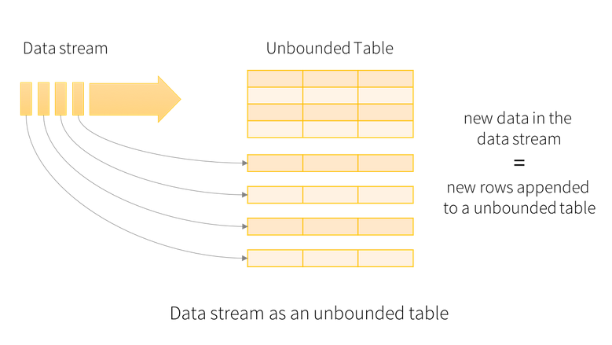
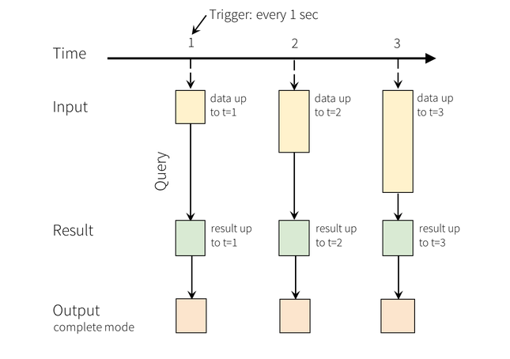
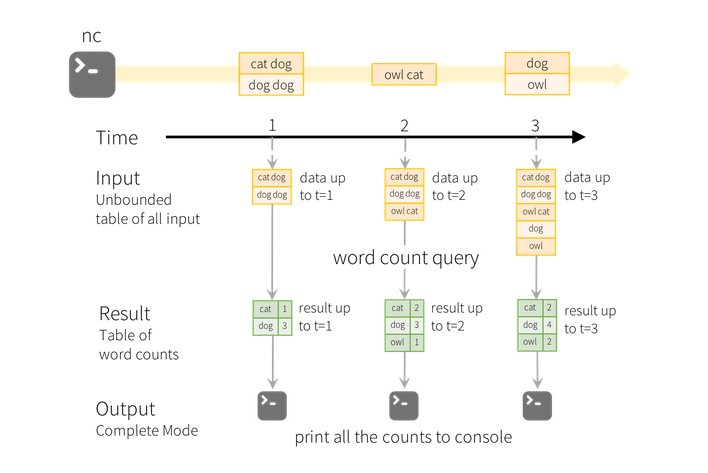
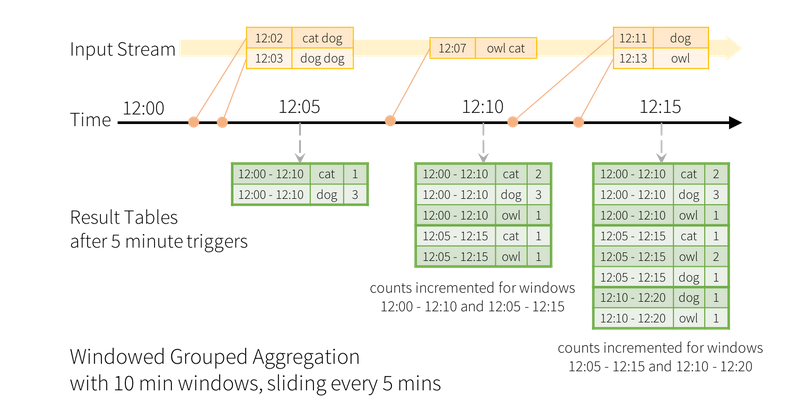
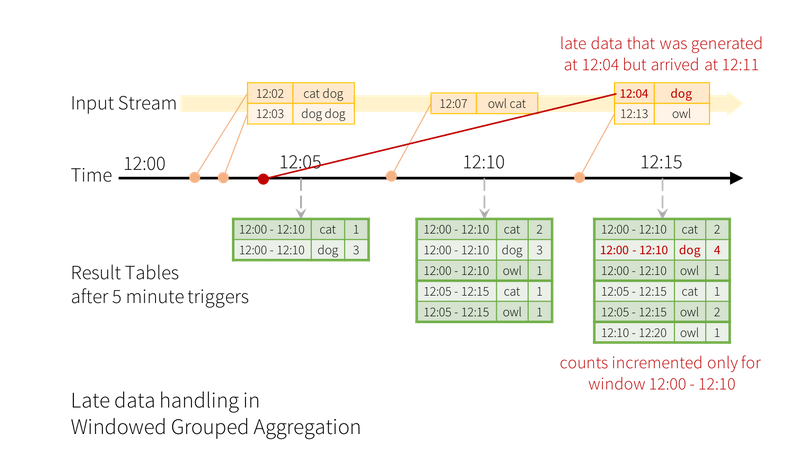
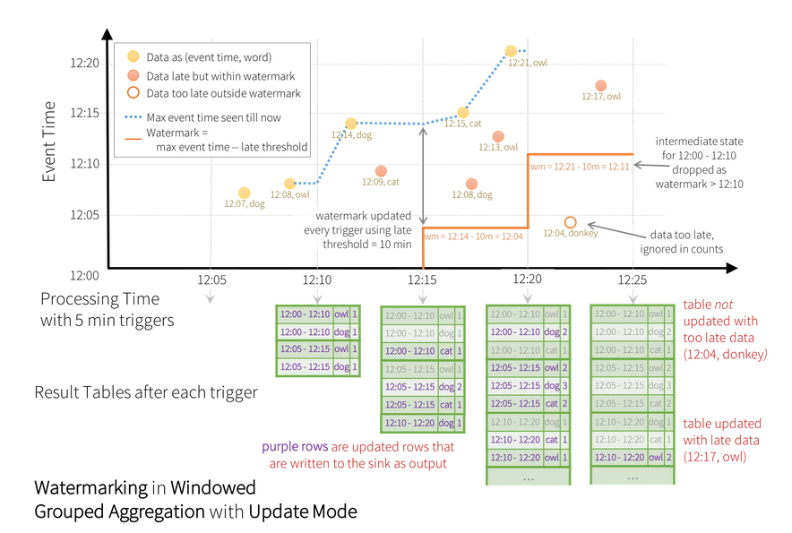
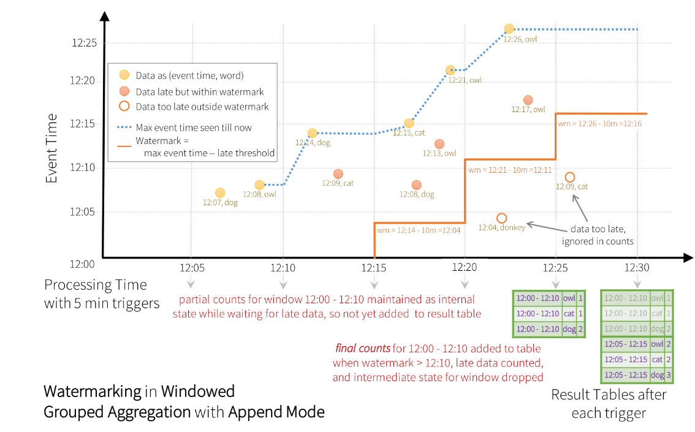

Structured Streaming is a very efficient stream processing engine built on top of the Spark SQL.

There is no significance difference in the way you define your computations between an input stream and 
a batch of static data. 

The SQL engine takes care of   running your queries or transformations incrementally, updating the results
as the streaming data continue to arrive. It should be also noted that Spark process each data *exactly once*.

Spark Streaming can work in two different modes: 

-   *micro-batch*, it the one used by default. The streams of data is processed as a series of small batches of data. 
    The latency in this case can decrease as low as 100 milliseconds.
-   *continuous processing*, the latency is decreased further, so that it can be achieved a 1 millisecond latency.

## Warming Up

Let's a very simple example. We want to count the number of words from a text stream coming  from
a tcp connection. More specifically, we want to compute the number of occurrences for each different word
read from the stream.

    import org.apache.spark.sql.functions._
    import org.apache.spark.sql.SparkSession
    
    val spark = SparkSession
      .builder
      .appName("StructuredNetworkWordCount")
      .getOrCreate()
    
    import spark.implicits._
    
    // Create DataFrame representing the stream of input lines from connection to localhost:9999
    val lines = spark.readStream
      .format("socket")
      .option("host", "localhost")
      .option("port", 9999)
      .load()
    
    // Split the lines into words
    val words = lines.as[String].flatMap(_.split(" "))
    
    // Generate running word count
    val wordCounts = words.groupBy("value").count()
    
    //run the above query and print the result to theh console
    val query = wordCounts.writeStream
      .outputMode("complete")
      .format("console")
      .start()
    
    query.awaitTermination()

In the above code we first create a `SparSession` which is responsible for the initialization of both the 
SQL engine and the stream processing engine.

The `lines` `DataFrame` represents the unbounded table containing the streaming data &#x2013; the unbounded table is 
the table that receive the input data from the stream, it is constantly updated &#x2013; which has only one 
string-valued column named value. Each line of the streaming text becomes a new entry. 

The `lines` variable is then converted into a `DataSet` of `String` values by splitting each line. 
After this operation you will have a new `DataSet` where each entry contains exactly a word.

In order to count the number of occurrence for each word, we need to first aggregate by the column
`value`  and then count.

So far we have just defined the operations, they are not actually run by the engine. In order to start 
the entire processing we need to write the stream &#x2013; in this case we print on the system console &#x2013; and then
call `start`.

Usually, when your run the query, you use `awaitTermination` so that process will continue to listen for 
new data until you ask it to stop.

# Programming Model

The main abstraction used in structured streaming is the Unbounded Table.
It is a table that  continuously grows, as new are fed into the stream and eventually into
the table &#x2013; new records are appended at the end of the table.

Figure   shows a high level representation of an unbounded table.

In the previous example, the unbounded table was the `lines` `DataFrame`. 
When a you run a query on the input, you generate a result table. This result table is updated 
every trigger interval &#x2013; for instance 1 sec &#x2013;  in order to account for newly generated data. 

The following figure shows how the result table is updated as time goes and new data is available from the
stream.

The bottom layer of the above image represents how Spark shows the results related to the query.
You have three different options:

-   *complete mode*, the entire Result Table will be written to the external storage
-   *append mode*, only the new rows appended in the Result Table since the last trigger will be written 
    to the external storage.
-   *update mode*, only the rows in the Result Table that are updated since the last trigger will be written to the 
    external storage.

Let's see how this model applies to the above example. 

The `lines` DataFrame is the input table while the `wordCounts` is the result table.  
Any time new data comes in, the counter all the counters are updated.

One main advantage of Spark Streaming as opposed to other solutions for stream processing is that
it keeps the minimum amount of data in order to run the query.

In this case, it means that it does not actually materialize the entire input table, but 
it keeps the minimal amount of *intermediate* data needed to update the result. 

This model prevents the programmer from having to reason about fault-tolerance and data consistency, as 
they are automatically managed by the Spark engine. 

## How to use Datasets and DataFrames

You can create streaming Datasets or DataFrames from a variety of different sources. 
For instance you can have:

-   File Source. Supported formats are: CSV, JSON, text, ORC and Parquet files
-   Kafka Source. For integrating Spark with Kafka
-   Socket Source. For reading text from a socket connection
-   Rate Source. For generating data at the specified number of rows per second. This source is used only for 
    testing and benchmarking

In order to use any of the above source you must the `readStream` method on the Spark session and then
specify a set of source-specific options, which are summarized in the following (not exhaustive) table:

<table border="2" cellspacing="0" cellpadding="6" rules="groups" frame="hsides">

<colgroup>
<col  class="org-left" />

<col  class="org-left" />

<col  class="org-left" />
</colgroup>
<thead>
<tr>
<th scope="col" class="org-left">Source</th>
<th scope="col" class="org-left">Option</th>
<th scope="col" class="org-left">Description</th>
</tr>
</thead>

<tbody>
<tr>
<td class="org-left">File</td>
<td class="org-left">`path`</td>
<td class="org-left">Path to the input directory</td>
</tr>

<tr>
<td class="org-left">&#xa0;</td>
<td class="org-left">`maxFilesPerTrigger`</td>
<td class="org-left">maximum number of new files to be considered in every trigger (by default no max is set)</td>
</tr>

<tr>
<td class="org-left">&#xa0;</td>
<td class="org-left">`latestFirst`</td>
<td class="org-left">True if the latest files have to be processed first</td>
</tr>

<tr>
<td class="org-left">&#xa0;</td>
<td class="org-left">`fileNameOnly`</td>
<td class="org-left">True if you want to ignore file extension</td>
</tr>

<tr>
<td class="org-left">&#xa0;</td>
<td class="org-left">`maxFileAge`</td>
<td class="org-left">Maximum age of a file before it is ignored</td>
</tr>
</tbody>

<tbody>
<tr>
<td class="org-left">Socket</td>
<td class="org-left">`host`</td>
<td class="org-left">the host to connect to</td>
</tr>

<tr>
<td class="org-left">&#xa0;</td>
<td class="org-left">`port`</td>
<td class="org-left">the port to connect to</td>
</tr>
</tbody>

<tbody>
<tr>
<td class="org-left">Rate</td>
<td class="org-left">`rowsPersecond`</td>
<td class="org-left">how many rows should be generate every second</td>
</tr>

<tr>
<td class="org-left">&#xa0;</td>
<td class="org-left">`numPartitions`</td>
<td class="org-left">the partition number for the generated rows</td>
</tr>
</tbody>

<tbody>
<tr>
<td class="org-left">Kafka</td>
<td class="org-left">`subscribe`</td>
<td class="org-left">Topic to subscribe to</td>
</tr>

<tr>
<td class="org-left">&#xa0;</td>
<td class="org-left">`kafka.bootstrap.servers`</td>
<td class="org-left">URL of a Kafka broker (you can specify more than one address)</td>
</tr>
</tbody>
</table>

Here are some examples:

    
    
    val spark: SparkSession = ...
    
    // Read text from socket
    val socketDF = spark
      .readStream
      .format("socket")
      .option("host", "localhost")
      .option("port", 9999)
      .load()
    
    socketDF.isStreaming    // Returns True for DataFrames that have streaming sources
    
    socketDF.printSchema
    
    // Read all the csv files written atomically in a directory
    val userSchema = new StructType().add("name", "string").add("age", "integer")
    val csvDF = spark
      .readStream
      .option("sep", ";")
      .schema(userSchema)      // Specify schema of the csv files
      .csv("/path/to/directory")    // Equivalent to format("csv").load("/path/to/directory")

It should be noted that in this examples Spark is not able to infer the schema at compile time. 
However, some operations like `map` or `flatMap` need to work with a compile time known type. In these case
you must first convert the `DataFrame`  into the corresponding, typed, `Datasets` and then run the 
map operations.

Also, interestingly, when you read data from a source file, Spark forces you to explicitly define the schema of your data.
In this way, avoiding runtime inference, Spark ensures consistency between the input and the output data.

# Stream Operations

## Basic Operations

Streaming datasets/dataframe are no different from the their batch counterparts. It means that they support any
operation that is also supported by a regular DataFrame/Dataset, ****although there are some exceptions**** which 
are listed below:

-   Multiple streaming aggregation &#x2013; you cannot define chain of aggregations
-   You cannot take the first N rows
-   Distinct operations are not supported
-   Sorting operations are only supported after you apply some aggregation on the input dataset, and only if 
    you use *complete* output mode
-   Some types of outer joins are not supported

-   Example

    Here is an  example on how to execute queries on a streaming dataframe. 
    
        case class DeviceData(device: String, deviceType: String, signal: Double, time: DateTime)
        
        val df: DataFrame = ... // streaming DataFrame with IOT device data with schema { device: string, deviceType: string, signal: double, time: string }
        val ds: Dataset[DeviceData] = df.as[DeviceData]    // streaming Dataset with IOT device data
        
        // Select the devices which have signal more than 10
        df.select("device").where("signal > 10")      // using untyped APIs   
        ds.filter(_.signal > 10).map(_.device)         // using typed APIs
        
        // Running count of the number of updates for each device type
        df.groupBy("deviceType").count()                          // using untyped API

## Window Operations on Event Time

One interesting feature provided by Spark streaming is the ability to aggregate data based on event-time windows.

For instance, let's change the first example a little bit. More specifically, here we want to count the number
of occurrences for each word and for each specific time-frame. Therefore, you can imagine there is a sliding
time window, which groups the input records accordingly to the timestamp the have been generated. 
You can think ad the log data coming from a web servers, each log is associated with a timestamp and it
has a text data associated with it. Therefore each entry has the following schema:

    {timestamp: Timestamp, word: String} 

The following image shows the result table if we set a time-window that has  a 10 minutes width and it moves
every 5 minutes:

To achieve the above result with must modify the above example as follows:

    val windowedCounts = words.groupBy(
      window($"timestamp", "10 minutes", "5 minutes"),
      $"word"
    ).count()

The above example means that we want to aggregate data accordingly to a 10 minutes time window which moves
forward, i.e., it is updated, every 5 minutes. 

Aggregating by a time window increases the complexity of the entire picture. In fact, it might happen that 
the time a record is generated is significantly different from the time the same data is received by Spark.

Here is an example:

Imagine you have to run the above query for days? In this case, if you allow the aggregation function to account
for data received with a, let's say, two days of delay, you will increase the footprint of your application 
in a very dramatic way. 
Therefore, we need a mechanism for letting Spark to understand when the intermediate result of a time window 
can be dropped, therefore any other data referring to that window can be ignored. 

For instance, in the above example, we want to ignore the update due to the arrival of the entry 
`\{12:04, dog\}` received two times windows after the one it refers to.

We can implement this mechanism with *watermarking*. With this behavior we can set a threshold to the 
maximum delay of any record. For instance if we want maximum 10 minutes delay for each time-window we can use
the following snippet.

    import spark.implicits._
    val words = ... // streaming DataFrame of schema { timestamp: Timestamp, word: String }
    // Group the data by window and word and compute the count of each group
    val windowedCounts = words
        .withWatermark("timestamp", "10 minutes")
        .groupBy(
    	window($"timestamp", "10 minutes", "5 minutes"),
    	$"word")
        .count()

Having a 10 minutes watermark means that any time windows cannot account for data arrived with more than
a 10 minutes delay.  More formally, for a specific window ending at time T, the engine will maintain the 
intermediate state and allow late data to update the state until
 `max event time seen - time threshold < T`

We have the following time windows:

-   w1 -> 12:00-12:10
-   w2 -> 12:05-12:15
-   w3 -> 12:10-12:20
-   w4 -> 12:15-12:25

Also, we have the following triggers:

-   t1 -> 12:05
-   t2 -> 12:10
-   t3 -> 12:15
-   t4 -> 12:20
-   t5 -> 12:25

The watermark is updated at every trigger. 

-   t1 -> no data is received, the watermark is not set
-   t2 -> the max event time is 12:08. The watermark is not set as 12:08 - 10 is lower than the starting time
-   t3 -> the max event time is 12:14. The watermark is set to 12:04. It means that any data with event time
    after 12:04 should be taken into account in order to update the time window w1 and w2.
-   t4 -> before the trigger is reached, two watermark updates happen. 
    -   The first   update happens when `{12:15, cat}` is received. The watermark is set to 12:05. It means that 
        the watermark is set to 12:05, therefore the `{12:08, dog}`  will be taken into account to update 
        w1 and  `{12:13, own}` is taken into account to update w2.
    -   The second watermark happens when  `{12:21, owl}` is received. The watermark thus becomes 12:11. 
        It means that any data with event time previous to this value will be ignored. 
        For this reason, `{12:04, donkey}` is ignored while `{12:17, monkey}` is considered to update 
        the time window w4

In the above example, the update output model has been enabled. It means that the result table is actually 
update after each trigger.

If we enable&#x2026;. all the intermediate steps are kept in memory and only the final result is written to the update table.

# Running Queries

Once you have defined the final result DataFrame/Dataset all that is left is for you 
is to start the steaming  computation. In order to do it, you need to obtain 
a `DataSteamWriter` by calling `writeStream` on the queried dataset. 
When you use a `DataSteamWriter` you need to specify the following information:

-   *details of the output sink*, Data format, location, etc.
-   *output mode*, specify what gets written to the output sink
-   *query name*, optionally, specify a unique name to the query
-   *trigger interval*. optionally, specify the trigger interval. It it is not specified
    the system will check for availability of new data as soon as the previous batch has been processed.
-   *checkpoint location*, for some output sinks, in order to obtain the fault tolerance you 
    need to specify where to store the information for a potential recovery.

## Output Sinks

Spark steaming provides a variety of built-in output sinks. 
Here are the most common ones.

-   ****File Sink**** - Supported Modes: Append

    writeStream
        .format("parquet")        // can be "orc", "json", "csv", etc.
        .option("path", "path/to/destination/dir")
        .start()

-   ****Kafka Sink**** - Supported Modes: Append, Update, Complete

    writeStream
        .format("kafka")
        .option("kafka.bootstrap.servers", "host1:port1,host2:port2")
        .option("topic", "updates")
        .start()

-   ****Foreach Sink**** - Supported Modes: Append, Update, Complete

    writeStream
        .foreach(...)
        .start()

-   ****Console Sink**** (debugging) - Supported Modes: Append, Update, Complete

    writeStream
        .format("console")
        .start()

-   ****Memory sink**** (debugging) Supported Modes: Append, Complete

    writeStream
        .format("memory")
        .queryName("tableName")
        .start()

