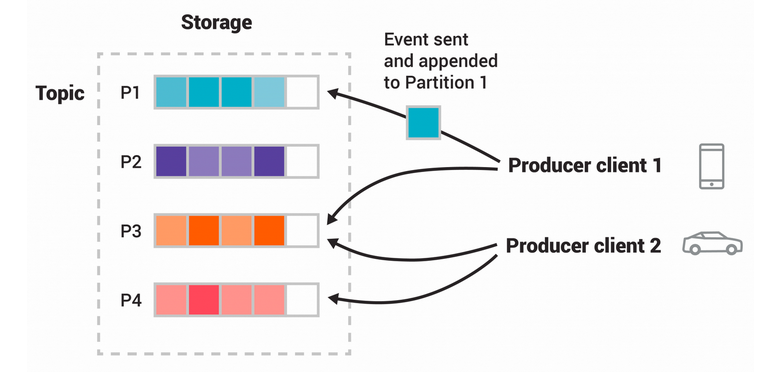
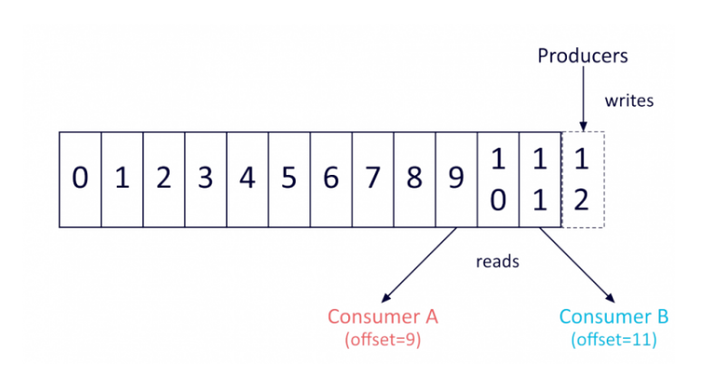
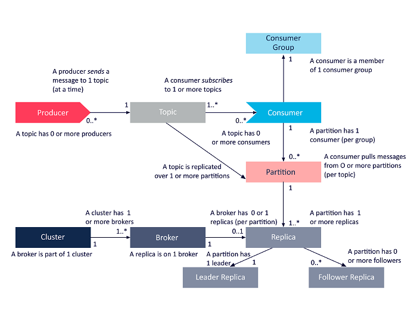

# Introduction

Apache kafka is a distributed streaming platform.

1.  What is Event Streaming?

    Event streaming is the practice of capturing data in real-time from 
    event sources like databases, sensors or mobile devices. 
    
    With event-streaming you need to design your application as an event-driven 
    application. This means that events your application has constantly to reach 
    to what is happening in its surrounding environment. 
    
    Event streaming nsures a continuous flow and interpretation of data so that the right information is at the right
    time. 

2.  What can I use event streaming for?

    There is number of different contexts where real-time processing is a real thing.
    For instance:
    
    -   To process payments and financial transactions
    -   To track and monitor cars, trucks, fleets and shipments
    -   To continuously capture and analyze sensor data coming from and IoT ecosystem
    -   To collect and immediately react to customer interactions and orders
    -   To monitor patients in a hospital to ensures timely treatment in emergencies
    -   To connect, store and make available data produced by different division of a company
    -   To serve as the foundation for data platforms and event-driven architectures

3.  Apache Kafka in the real world

    Here is a list of company that are using Kafka:
    
    -   *The New York Times*
    -   *Pinterest*
    -   *zalando*
    -   *line*
    -   *adidas*
    -   *airbnb*
    -   *cisco*

4.  What does it mean to be an event streaming platform?

    Kafka combines together three key capabilities:
    
    -   **publish** (write) and **subscribe to** (read) to stream of events
    -   **store** streams of events in a durable and reliable fashion
    -   **process** streams of event as they occur or retrospectively
    
    All this functionality is provided in a distributed, highly scalable, elastic, fault-tolerant and
    secure manner.

5.  How does Kafka work in a nutshell?

    The Kafka system consists of **servers** and **clients** communicating with each over via high-performance
    TCP network protocol. 
    
    -   **SERVERS**. Kafka runs on a cluster comprising several servers which can be distributed across different
        datacenters or cloud regions.
        One of  the advantage of using Kafka as a cluster is that if a server goes down there is always
        another server that  will cover for the failed server &#x2013; this means being fault-tolerant.
    -   **CLIENTS**. In the client-side of a Kafka application are to one in charge of the process either
        writing or process the stream of events. 
        Kafka has several client libraries that allows you to develop kafka clients in a variety of 
        different languages.

6.  Main Concepts and Terminology

    Kafka is built around the following concepts:
    
    -   **Event**. Generally speaking, an event records the fact that *something happened* in your business world. 
        An event is often referred as **message**. 
        An event is associated with a key, and it has a value and a timestamp (plus, optional metadata).
        An example is the following:
        -   Event Key: "Alice"
        -   Event Value: "Made a payment to Bob"
        -   Event timestamp: "Sept 29, 2020 at 11:00"
    
    -   **Producers** and **Consumers**.  The producers are all the client applications that write the events 
        on Kafka, while the consumers are those application that *subscribe* to these events, thus they are 
        the one consuming the data produced by the producers.
        Kafka provides several guarantees, for instance with Kafka you have the guarantee that each event
        will be processed exactly once
    
    -   **Topics**. Event are organized in topics. They resemble the concept of folder within a file system.
        For instance, you can have a topic called "payments" that records all the transactions that happened
        in your business.
        
        A topic can have zero-to-multiple producers or receivers. 
        
        Events can be consumed any time, in fact they can reside with the Kafka storage system for 
        an arbitrarily long time, without affecting the performance of the application. In fact,
        one cool feature about Kafka is that its operations are constant with respect to the data size.
        Therefore, storing data for a long time is perfectly fine.
    
    -   **Partitions**. Usually, a topic is spread across different "buckets" located on different Kafka
        brokers.
        When an event occurs, it is actually appended to one of the topic partitions, 
        Kafka is able to guarantee:
        -   Events with same event key are always written in the same partition
        -   Consumers  read the event within the same partition in the exact order of arrival
    
    
    
    -   **Replica**. In order to achieve the fault-tolerance and high-availability each topic is
        replicated across different datacenters or geographical regions. 
        Therefore there are always multiple brokers that have a copy of the data, just in case something
        goes wrong. 
        A commonly used setting is to use a replication factor of 3 &#x2013; these each data is copied three times.

# QuickStart

1.  Step-1: Download Kafka from: [https://downloads.apache.org/kafka/2.6.0/kafka2.13-2.6.0.tgz](https://downloads.apache.org/kafka/2.6.0/kafka_2.13-2.6.0.tgz)

        wget https://downloads.apache.org/kafka/2.6.0/kafka_2.13-2.6.0.tgz
        tar -xzf kafka_2.13-2.6.0.tgz
        cd kafka_2.13-2.6.0

2.  Step-2: Start the Kafka Environment

    First you need to activate the Zookeeper service. 
    
        zookeper-server-start.sh config/zookeper.properties
    
    In another terminal session run:
    
        kafka-server-start.sh config/server.properties

3.  Step-3: Create a topic to store your events

    Before you can write your first event you have to create a topic.
    
    In order to create a topic, you must issue the following command:
    
        kafka-topics.sh --create --topic quickstart-events --bootstrap-server localhost:9092
    
    If you want to obtain some information on the topic you have just created, you need to issue the 
    following command:
    
        kafka-topics.sh --describe --topic quickstart-events --bootstrap-server localhost:9092

4.  Step-4: Setup a producer and a consumer from the command line

    First you need to setup a *producer*. There is a built-in command line tool.
    
        $ kafka-console-producer.sh --topic quickstart-events --bootstrap-server localhost:9092
    
    Then you can produce messages directly from the console:
    
        > my first event
        > my second event
    
    There is also a built-in command line tool for the consumer. 
    You can run the following command:
    
        kafka-console-consumer.sh --topic quickstart-events --from-beginning --bootstrap-server localhost:9092

# Kafka Architecture

Kafka is essentially a commit with a very simple data structure that is able
to be extremely fault tolerant and (horizontally) scalable.

The Kafka commit log is basically ad queue where the records cannot be directly 
deleted or modified, but they can only be appended at the end of the data structure.

The order of items stored in the queue reflects the order of arrival to the system.
In particular, for all the messages stored in the same partition kafka guarantees its order.

Because of this strong guarantee, records are immutable, once they are in the queue
they cannot be modified.

Moreover, Kafka automatically assigns each record with a unique sequential ID, known
as "offset".

# Component Overview

In the Kafka architecture the following entities are involved:

-   Topics
-   Producers
-   Consumers
-   Consumers groups
-   Clusters
-   Brokers
-   Partitions
-   Replicas
-   Leaders
-   Followers

The following diagram provides a high lever overview of how 
these components interact with each others

# Kafka API Architecture

There are four different APIs:

1.  **Producer API**. It enables an application to publish a stream of records to one 
    or more Kafka topics.
2.  **Consumer API**. It enables an application to subscribe to one or more Kafka topics.
    It also enables an application to process the stream of data deriving from the topic it 
    is subscribed to.
3.  **Streams API**. It enables an application to process  input streams and to produce 
    other streams as output. It is very useful when you need to design stream-oriented applications
4.  **Connect API**. It connects application or data systems to Kafka topics.
    For instance, with the Connect API, a connector could capture all the updates 
    to a database and ensure that all the updates are available within a Kafka topic

# Kafka Cluster Architecture

Here is a list of the main Kafka components within a Kafka cluster.

1.  Broker

    Any server within a Kafka cluster is considered a Kafka Broker.
    Brokers achieves the requirement of fault-tolerance, reliability and 
    availability at the heart of the Kafka ecosystem.
    
    Each broker is able to handle, thus to read and write, hundreds of messages every second.
    
    A broker has a unique ID and it responsible for a number of partitions belonging to one of
    more topics.
    
    The brokers leverage ZooKeper to elect a leader among them. A leader is in charge 
    for dealing with client requests directed towards a particular partition.
    
    Clearly, the more brokers are in the cluster, the higher the reliability of the entire
    system will be.

2.  Apache Zookeeper Architecture

    ZooKeper is the manager of the entire cluster.
    It knows, every time, who are the nodes involved in the cluster and
    it notifies the other brokers when something changes in terms of 
    topics added or removed. 
    
    For instance, when a new Broker joins the cluster, ZooKeper is responsible for
    informing the entire cluster. It does the same thing also when a Borker fails.
    
    Furthermore, the ZooKeeper coordinates the  elections of the leader of each partition.
    
    The election is run every time something changes from the broker perspective.

3.  Producer

    It represents a data source. The process that publishes messages to 
    one or more Kafka topics.
    
    A Kafka producer is also able to balance the data among  different brokers

4.  Consumer

    It reads data by reading messages directly from the topics it is subscribed to.

# Kafka Architecture

The following concepts are the main concepts required to understand the entire 
framework.

1.  Kafka Topic

    It is basically a channel through which data is streamed. 
    
    Producers publish their messages to topics while consumers read messages from
    the topic thy are subscribed to.
    
    Topics are useful because they provide the ability of organizing messages within
    groups. A topic is identified with a unique names within the same Kafka cluster.
    
    There is no limit to the number of topics that can be created on the same cluster.

2.  Kafka Partitions

    Topics are divided into partitions. 
    The partitions are also replicated across the different brokers partecipating to
    a Kafka cluster.
    
    From each partition, multiple consumers and producers can read and write in parallel.
    
    All the messages  that have the same keys will be written on the same partition.
    
    As regards messages without a key, they will be written among different partitions in
    a round robin fashion.
    
    Messages with the same key will be processed respecting the order of their arrival.
    
    There is no limit on the number of different partitions that can be created on 
    topic.

3.  Topic Replication Factor

    Replicating data is essential in order to achieve both availability and reliability.
    The replication factor determines how many replicas are there for every topic.
    
    It is defined on the topic level and it applies on the partition level.
    
    For instance, a topic replication factor of 3 means that each partition, belonging to 
    that topic, will be replicated 3 times. 
    
    Given a topic, for each partition a broker is elected as leaders while the other ones
    are in charge of keeping the replicas. 
    
    Clearly, the replication factor cannot be greater than the total number of brokers.
    
    When a replica is up to date with the leader is said to be an In-Sync Replica (ISR)

4.  Consumer Group

    A group of consumers includes all the consumers that share a common task.
    
    When Kafka sends messages to a group of consumers, each individual consumer is assigned
    to a particular partition, then only that particular consumer will read from that partition.
    This means that there is a one-to-one relationship between partitions and consumers within
    the group. As a consequence, if the number of consumer within group exceeds the number
    partitions, some consumer will be inactive.

# Understanding the entire Architecture

Here we focus on understanding how the components 
presented above cooperate with each others.

1.  Example 1: One Consumer, One Producer

    

2.  Example 2: One Producer, Multiple Consumers

    

3.  Example 3: Consumer Groups

    

