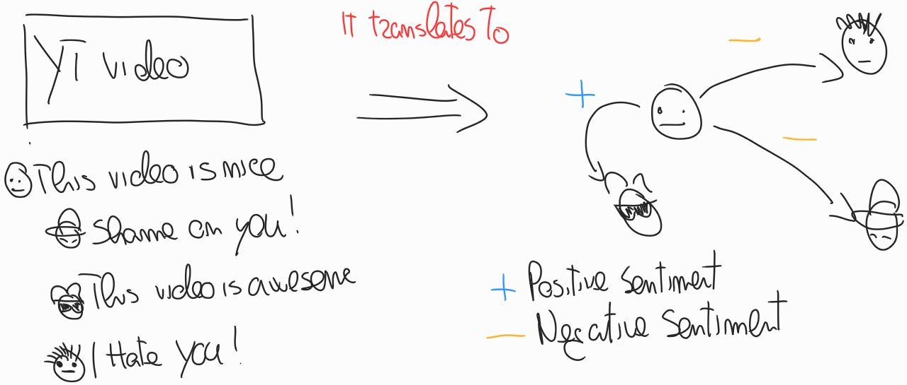

# Introduction

The goal of this project is to build an interaction graph starting from the 
comments associated to a collection of YouTube videos.

The entire pipeline is organized as follows: 

1.  A user provides a certain query *q*
2.  *q* is executed via the YouTube API.
3.  The query returns a collection of related videos \(V\). 
    -   For each video \(v \in V\), extract the collection of comment threads underlying \(v\)
    -   Each comment thread \(t \in T\) has a number of comments. Among them, there is the *top-level*
        comment, which represents the comment that started the discussion.
4.  Create an edge from a user u to another user v, if u is the author of a *top-level* comment of a thread where v has participated in.
5.  Associate a score to each edge that matches the sentiment score of the comment.

The following image shows the process behind the extraction of the interaction graph.

# Architecture

The project has the following components: 

-   *DataAPI*. It executes and manages the queries to the YouTube API
-   *Kafka-Producer*. It is in charge of the data download and the data transmission to Kafka
-   *Spark-Consumer*. It extracts the interaction graph directly from Kafka.

# Dependencies

-   Apache Avro for data serialization
-   CoreNLP for sentiment analysis - download the following [jar](http://nlp.stanford.edu/software/stanford-corenlp-latest.zip) and put it in the lib of the Spark-Consumer

# How to run the project

You need a working docker distribution on your machine, with docker-compose.

1.  Go to the Docker directory and run

    docker-compose up -d

1.  Then go to the *DataAPI* compile your project by running `mvn package`, then move the jar file into 
    the `lib` inside the *Kafka-Producer* root folder.
2.  Run the producer with `sbt run` providing all the necessary arguments
3.  Run the consumer with `sbt run` providing all the necessary arguments

